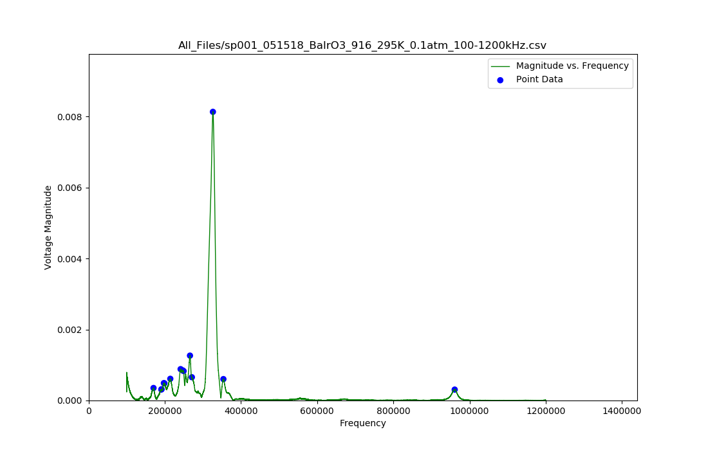
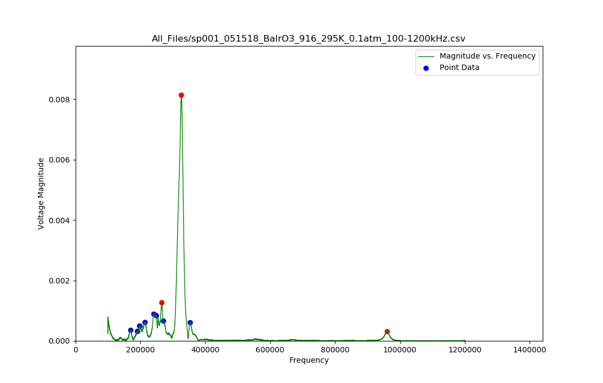
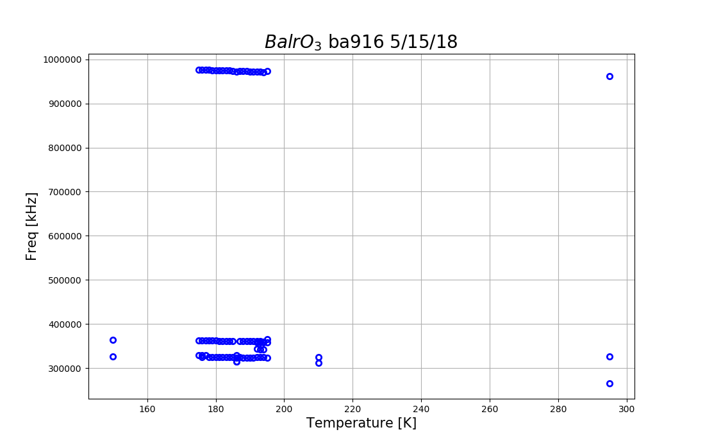
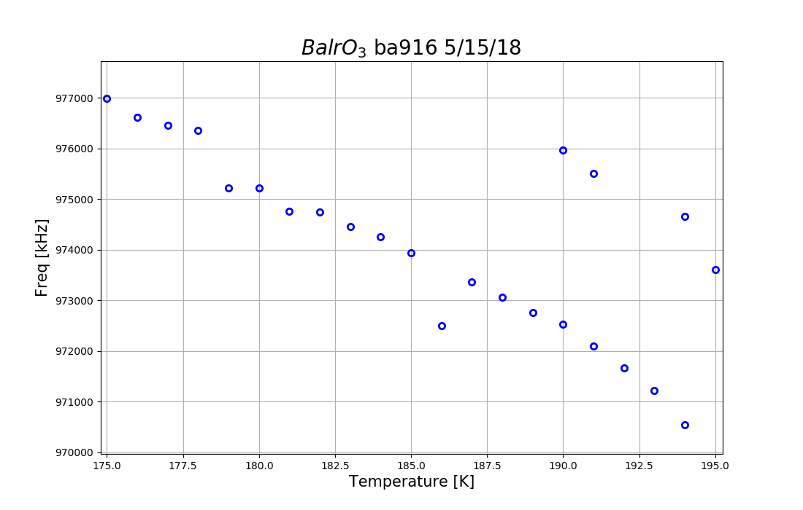

## New Prompt: ##
1. Extract peaks
2. And fit a complex function to the in phase and out of phase response
   The idea is to be able to plot central peak frequency (or peak
   width) vs temperature.

## Problem Statement: ##
In this lab, we are trying to find all of the peaks, in some signal data.
This problem is made more difficult by the fact that the data is very noisy.
We want to find the peaks in the dataset, that are representitive of the
signal, but not that of the noise.

## What I Was Given: ##
* [.xlsx .csv] files: that contain all of the signal data, and some first
  guesses as to what the more significant peaks are.

## Current Solution: ##
* I have written some python code that will incrementally display the data
  contained in each file, in an interactive graph.
    - The graphs have a built in click feature, that will allow you to click
      on all of the plotted peaks. When a peak is clicked on, this indicates
      to the program that this peak is coming from the signal data, and not
      from the noise, and this point will be tracked by the program.
      Points that are being tracked may also be clicked on again in order to
      indicate to the program that a particular point should no longer be
      tracked.
    - This effectively delegates the labor of choosing the significant peaks
      to the user of the program.

## Python Files ##

### Imports ###
The following libraries must be installed in your python enviroment in order
to run my program.
* `matplotlib`
* `matplotlib`
* `numpy`
* `pandas`

### FileData.py ###
This file does most of the work in this program. This file contains the class
`File_Data`. This class stores all of the data associated with the files
being analyzed. It does all of the parsing, and stores all of the relevant
information in instance variables.

### ClickPlot.py ###
This file contains a function called `click_plot`. This function creates
clickable plots of the data that is passed into it. This function takes two
two datasets:

1. Signal_data: This data is plotted, but is not made to be clickable
2. Point_data:  This data is plotted, and made to be clickable on the graph.

When a point is clicked, its location is recorded, and returned by this
function.

### PeakClicker.py ###
This is the file that is meant to be ran. This file uses the other two modules,
to create a composite graph of all of the points that were clicked on.
This file also accepts a directory argument. An example call to this module
is shown below:

* `python PeakClicker.py --data_dir All_Files`

After running the program, you will see a plot that should look something like
the following.

The blue points represent peaks that are not currently being tracked.
You can than press on one of the blue peaks, and they will turn red.
The red points represent peaks that are currently being tracked.

In order to move on to the next graph, simply close the current one.

After all of the important peaks have been picked, a composite plot of all of
the peaks will display.

you can than zoom in on the
points of interest, in order to get a graph that looks like the following.

### NOTE ###
* This program should execute properly on unix based systems.
* I am note sure whether or not the following line in the FileData module
  will execute properly on Windows machines.
    - `str_files  = subprocess.check_output(["ls "+directory+" | grep '\.csv$'"],shell=True).decode("utf-8")`

## Goals: ##
* It would be better if I developed a program that could find the most
  significant peaks on its own, however, since I was not given much information
  about the data I was looking at, this is a difficult task.
