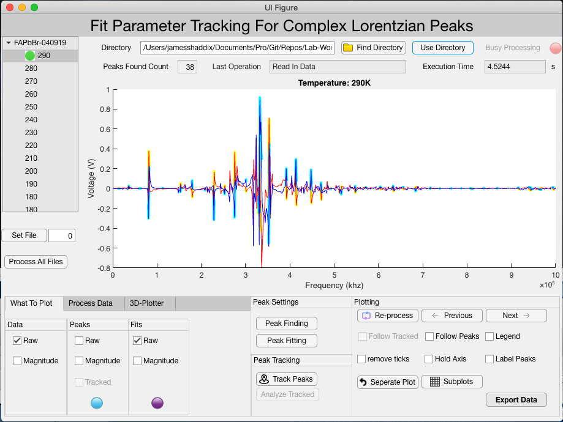

# rus-probe
* Authors:
  1. James Shaddix
  2. Andrew Sexton

# Book #
* This book is a good refference for our experiment.
[Robert G Leisure. Ultrasonic Spectroscopy](https://www.cambridge.org/core/books/ultrasonic-spectroscopy/D4A1831DE2E596E6EC393A5B85B69E63)

# Directories #
* 1-GettingData: Describes how data was acquired.
* 2-FilesToAnalyze: Contains the files that will be analyzed.
* 3-Analysis: Contains the code that is used to perform analysis
* 4-renaming: some python scripts for performing batch renaming of tdms files we are
  analyzing
* web: A directory with scripts I am working on for generating plots with plotly

