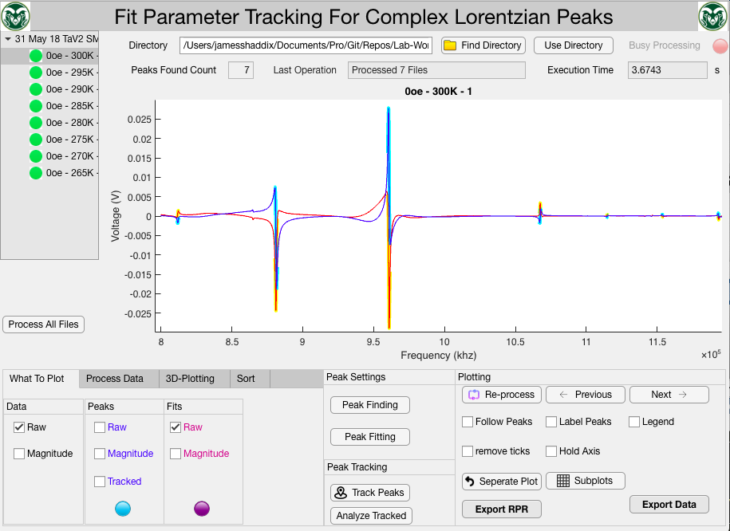
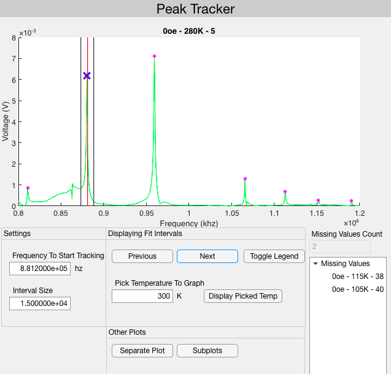
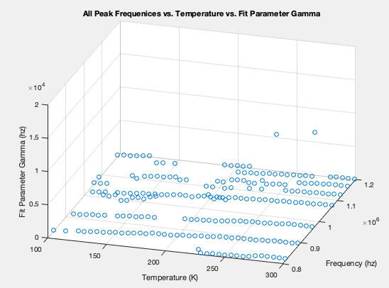
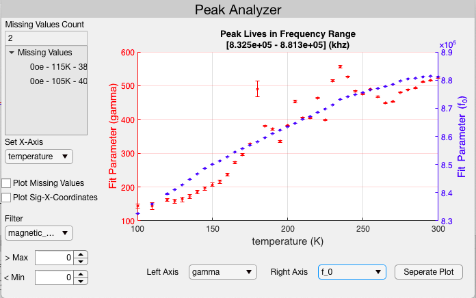
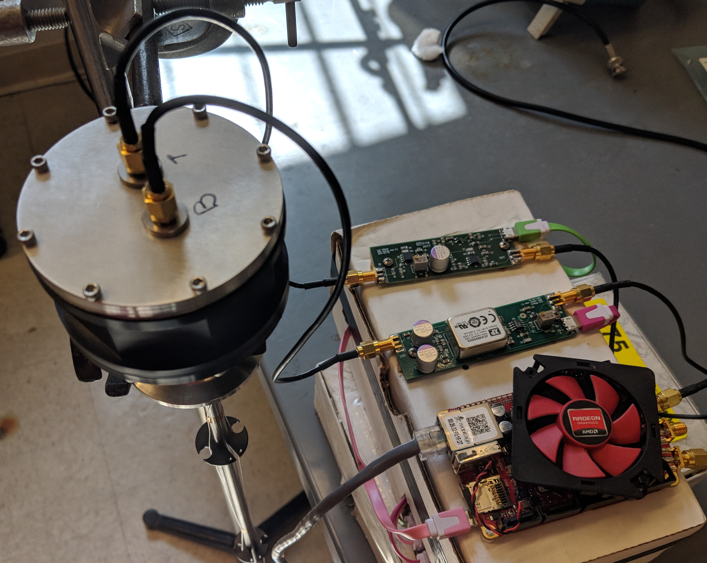
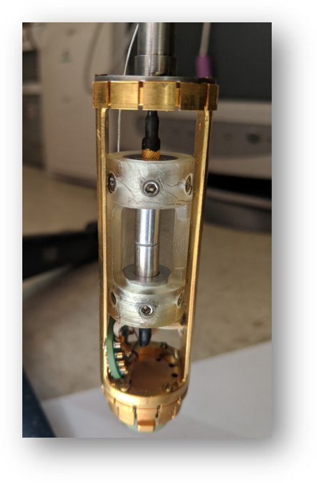
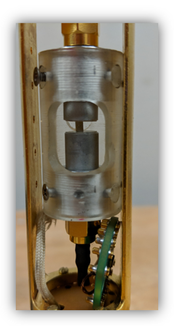

# RUS-Probe
RUS (Resonant Ultrasonic Spectroscopy):
* Author: James Shaddix

I developed this application for the research group
I am apart of at Colorado State University. I work 
as a member of one of Dr. Kate Ross's Condensed Matter 
research teams. You can view her website [here](http://www.rosslabcsu.com/people/).

## Note
The current version of this application is 
stable, but I am still working 
on its development. 

## Installation
* [mlapp installation file](/Analysis/tdms_peak_analysis/Data_Analyzer.mlappinstall)
## Description:
This repository contains a Matlab dashboard application that was developed 
for doing data analysis for a Condensed Matter Physics experiment 
involving Resonant Ultransonic Spectroscopy. 

### What is this Dashboard for?

#### Functionality 
1. This application reads signal data from .tdms files.
2. The tab menu on the bottom left provides an interface for pre-processing 
   all of the data. Currently, this allows the user to remove linear trends, and
   use a smoothing algorithm on the data.
3. The application than finds all of the peaks in the data, and fits the peaks
   to a lorentzian model. How the program finds and fits the peaks 
   can be configured from menus in the program that accept user inputs.
4. The tab menu in the bottom left provides a section for sorting the files 
   that will be analyzed. The files can sorted based on their temperature or magnetic field. The user is also presented with the option of performing two factor 
   sorting of the files.
5. If you would like to analyze the data in program, the export data button 
   provides the user with a menu that can be used to export all of the data 
   generated by my program into a .mat file.
6. The rpr button provides an interface for exporting all of the data 
   into input files for the rpr.exe program.
7. The program also comes with a dashboard interface for tracking a particular 
peak across each of your datasets.

8. This program also provides a bunch of different methods for visualizing the data.

#### Data Visualization
1. On bottom right hand of the program, there is a menu for configuring the plot 
   that is displayed in the main menu. 
2. The 3D plotter tab (bottom left), allows the user to specify parameters to use
for creating 3-dimensional plots of the data. The user
can choose the axis for the plot to represent the 
temperature / magnetic field / frequency / or any 
of the fit parameters in the lorentzian model. 

3. The Analyzed Tracked button provides 
another dashboard interface for 
making 2D plots of the same data mentioned 
in the previous bullet.

## Book
* This book is a good refference for resonant ultrasonic spectroscopy.
[Robert G Leisure. Ultrasonic Spectroscopy](https://www.cambridge.org/core/books/ultrasonic-spectroscopy/D4A1831DE2E596E6EC393A5B85B69E63)

## Directories
* 1-GettingData: Describes how data was acquired.
* 2-FilesToAnalyze: Contains the files that will be analyzed.
* 3-Analysis: Contains the code that is used to perform analysis
* 4-renaming: some python scripts for performing batch renaming of tdms files we are
  analyzing
* web: A directory with scripts I am working on for generating plots with plotly

# Data Collection / Setup

## Probe Setup
A [Red Pitaya](https://www.redpitaya.com/index2) 
(seen to the bottom right) is connected to two **amplifier boards**.
Each of the amplifier boards is connected to a transducer. 

## Experiment
The crystal samples whose properties we would like to measure is placed inbetween
the two transducers. The red pitaya than sends a driving signal to one of the 
transducers, causing it oscillate. The sounds waves from the 
oscillation than travel through the crystal sample, and 
are picked up by the other transducer. We than extract the data
associated with electric signal and this dashboard application can 
analyze it.

## Transducer Images

The transducers in this system are [piezoelectric crystals](https://en.wikipedia.org/wiki/Piezoelectricity). Piezoelevtric crystals exhibit the 
[piezoelectric-effect](http://www.nanomotion.com/piezo-ceramic-motor-technology/piezoelectric-effect/).
The **piezo-effect** is a reversible process in which certain materials generate
an electric charge, in response to some mechanical stress. In this
case, are transducers expand and contract when they 
recieve an electric signal. The transducers in this
experiment were designed and built at [Los Alamos National Laboratory] (https://www.lanl.gov/).

Measurements of the system are taken inside of a [ppms (physical property
measurement system)](https://www.qdusa.com/products/ppms.html). Which is capable
of temperatures as low as 1.8K and magnetic fields as high as 9 Tesla (90,000 gauss)

## Software ##
1.) **lab actor program:** Is used to interface with the **red pitaya**. Developed
by Los Alamos National Laboratories.

2.) **Comms Client program:** Allows remote control of Lab Actor through TCP. Developed
by Los Alamos National Laboratories.

3.) **Integrated Client** (Developed by: Andrews Sexton) Uses QD produced Labview VI's
alongside the Comms Client to remotely control the PPMS and LabActor simultaneously in
order to automate the process.

* RUS stands for: Resonant Ultrasonic Sprectroscopy.

