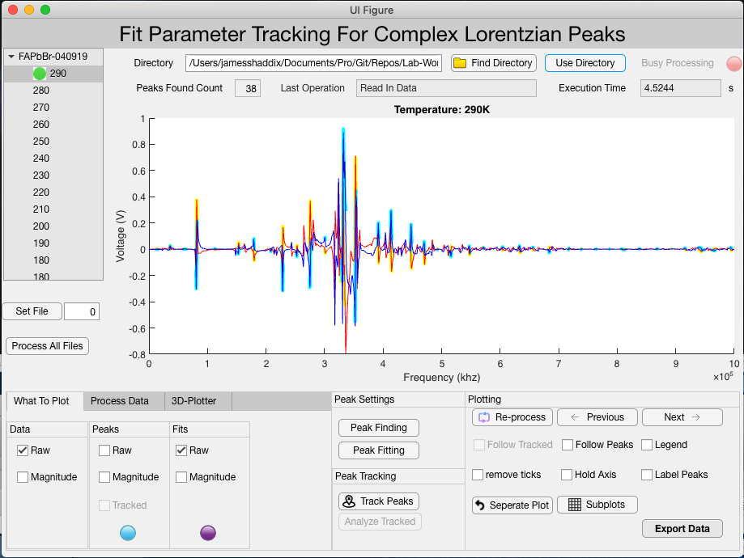

# rus-probe
* Author: James Shaddix

# Installation #
Link to [install file](3-Analysis/tdms_peak_analysis/Data_Analyzer_App.mlappinstall)

# Book #
* This book is a good refference for our experiment.
[Robert G Leisure. Ultrasonic Spectroscopy](https://www.cambridge.org/core/books/ultrasonic-spectroscopy/D4A1831DE2E596E6EC393A5B85B69E63)

# Directories #
* 1-GettingData: Describes how data was acquired.
* 2-FilesToAnalyze: Contains the files that will be analyzed.
* 3-Analysis: Contains the code that is used to perform analysis
* 4-renaming: some python scripts for performing batch renaming of tdms files we are
  analyzing
* web: A directory with scripts I am working on for generating plots with plotly

# Data Collection Setup #

## Probe Setup ##

## Transducer Images ##

## Things to Work On ##
1. give more options for the 3D plotter
2. allow the 3d plotter to plot the tracked peak.
3. update the peak tracker so that the gui auto detects the first peak,
   and saves the updated settings.
4. allow the peak analyzer to take input so that it can plot vertical lines.

